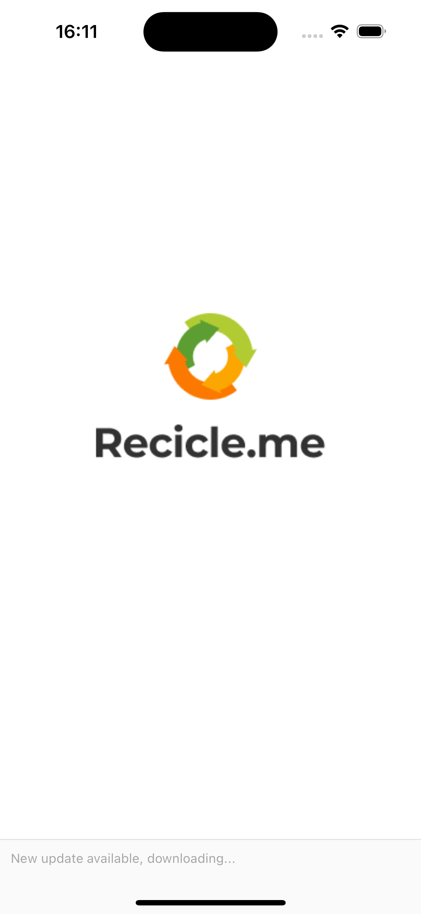
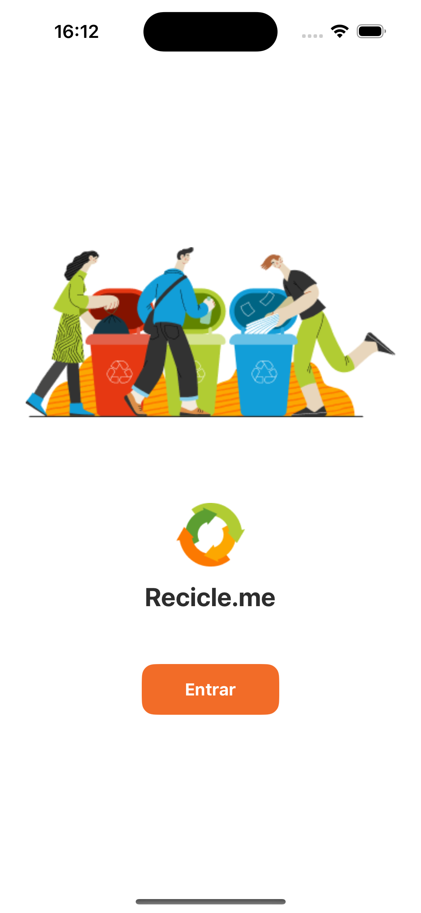
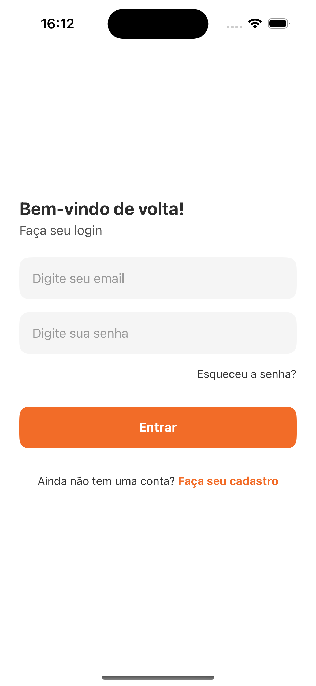
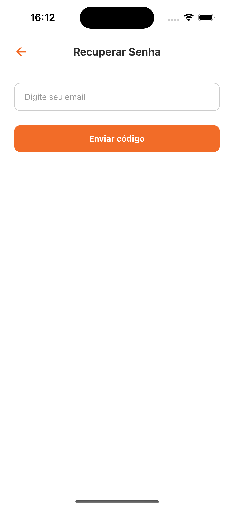
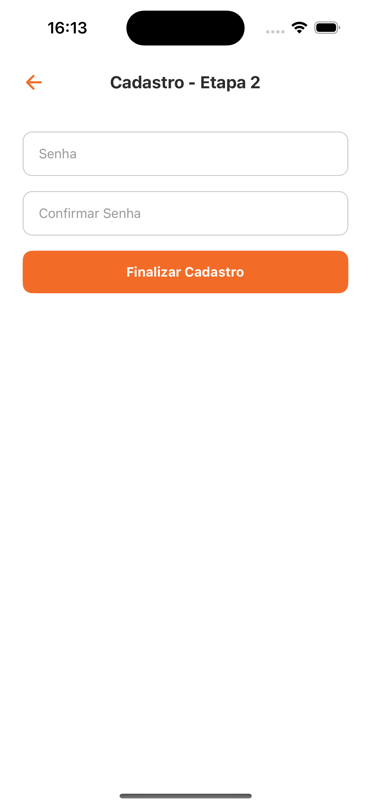
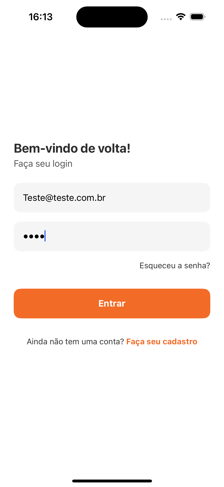
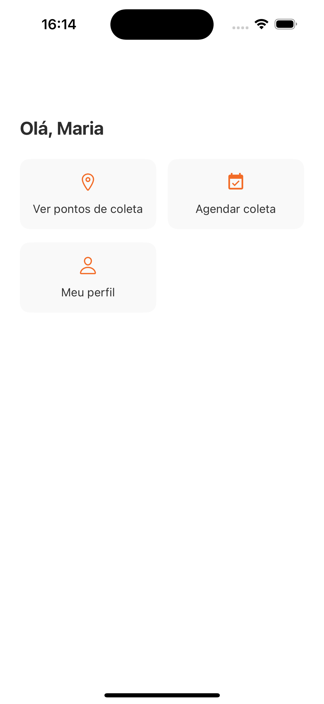
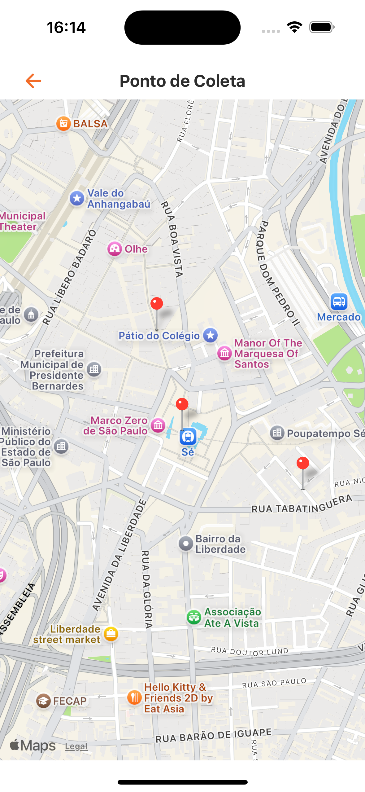

# ♻️ Recicle.me

Aplicativo mobile desenvolvido em **React Native com Expo** para facilitar o agendamento de coletas de lixo reciclável e visualização de pontos de coleta próximos.

---

## 📱 Telas do Aplicativo

### Splash + Onboarding

  
  

### Login e Recuperação de Senha

  
  

### Cadastro - Etapas 1 e 2

  
  

### Home

  

### Pontos de Coleta (Mapa)

  

### Agendamento de Coleta

  

---

## 🔧 Tecnologias Utilizadas

- React Native + Expo
- Async Storage
- React Navigation
- Expo Camera
- React Native Maps

---

## 💡 Funcionalidades

- Autenticação simulada (login e cadastro)
- Cadastro em duas etapas
- Recuperação de senha
- Visualização de pontos de coleta em um mapa (mock)
- Agendamento de coleta com envio de foto
- Armazenamento de preferências do usuário

---

## 📦 Armazenamento com AsyncStorage

Atualmente, o app armazena:

- Preferência de receber notificações (`notifications`)

---

## 📸 Uso da Câmera

A câmera é utilizada na tela de agendamento, permitindo que o usuário capture uma imagem do lixo reciclável para facilitar o processo de coleta.

---

## 🔗 Repositório

🔗 [GitHub - lukesteves92/Recicleme-App](https://github.com/lukesteves92/Recicleme-App)

---

## 👤 Autor

**Lucas Esteves**
